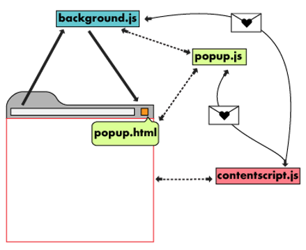

# 深入Chrome插件开发

## 简介

Chrome 插件可以做很多事情，比如做json格式化的[JSON Formatter](https://chrome.google.com/webstore/detail/json-formatter/bcjindcccaagfpapjjmafapmmgkkhgoa?hl=en)，将json在web端的可读性提升了N个级别；前端工程师们，经常需要在页面上copy文字，可能需要这个[Auto Clipboard](https://chrome.google.com/webstore/detail/inhnhgihdkbalmmojcbpalkkmhkmcdjm)插件，只要选中文本，自动复制到剪切板。

Chrome插件入门级的教程网上已经有很多了，这里就不再赘述，需要注意的是，网上大部分教程都是基于Manifest V2的，目前最新的Manifest版本是V3，并且，2022年1月中旬，Chrome不再接受Manifest V2插件的发布，所以建议没有接触过Chrome插件的同学，先参考Google官方的简单例子[Chrome Extensions samples](https://github.com/GoogleChrome/chrome-extensions-samples)了解一下再往下看。

## 组成Chrome插件的基本元素

一个Chrome插件的基本元素包括后台脚本（background.js）、内容脚本（content_scripts.js）、配置页面（options page）、弹窗页面（popup page）以及清单（manifest.json）

它们的作用如下：

- 后台脚本（background.js）运行在后台的js文件，通常用来监听事件，注意：**后台脚本不能访问DOM**
- 内容脚本（content_scripts.js），注入到已加载的浏览器页面上下文中执行的js文件，如果页面包含iframe，内容脚本会在每个iframe内嵌页面上下文中执行
- 配置页面（options page），顾名思义，用来做插件的个性化配置的页面，配置可以保存到chrome.storage，类似于localStorage，chrome.storage分为chrome.storage.local和chrome.storage.sync，chrome.storage.sync会自动同步到用户登录的任何Chrome浏览器，chrome.storage.local则只会保存到本地
- 弹窗页面（popup page）用户点击Chrome右上角的插件图标时，弹出来的页面
- 清单（manifest.json）用来配置配置插件的版本、权限以及后台脚本、内容脚本、配置页面、弹出页面等，所有的配置请查看官方开发者文档[Manifest file format](https://developer.chrome.com/docs/extensions/mv3/manifest/)

## 各元素之间的关系

Chrome插件基本元素可以单独运作，也可以相互协作。

清单除了可以用来做插件的配置，还可以使用“commands”定义一些键盘快捷键，在后台脚本使用chrome.commands.onCommand.addListener监听快捷键的触发

内容脚本、配置页面、弹出页面三者与后端脚本的通信，通过chrome.runtime.sendMessage发送信息，后端脚本使用chrome.runtime.onMessage.addListener监听



## 如何解决插件热更新问题？

热更新在前端开发领域是个标准配置，但是到了Chrome插件开发，会发现插件不会随着代码的热更新而重新加载。查阅Chrome插件开发者文档，发现有个chrome.runtime.reload，是用来重新加载插件的，可以解决这个问题。

回顾前面所讲，可以配置一个快捷键，一键刷新插件

在manifest.json 增加如下配置

```json
"commands": {
  "reload_extension": {
    "suggested_key": {
      "default": "Ctrl+Shift+K",
      "mac": "Command+Shift+K"
    },
    "description": "重新加载插件"
  }
}
```

接着在后台脚本监听快捷键

```js
chrome.commands.onCommand.addListener((command)=>{
  if(command === 'reload_extension'){
    chrome.runtime.reload();
  }
});
```

配置完成后，代码更新后只需要按下快捷键，即可刷新插件。当然，更好的做法是，将这个刷新插件的功能单独做成一个插件，因为这跟插件的业务功能没有关系，只是开发需要，不应该放到一起。

## 配置页面和弹出页面可以做成多页面吗？

可以。配置页面和弹出页面有各自的入口文件，可以分别做成单页应用，使用前端路由切换多页面。

## 如何在页面里插入自定义页面？

某些场景下，需要在第三方页面上插入自己的DOM元素，
