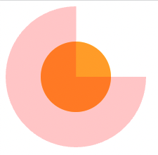
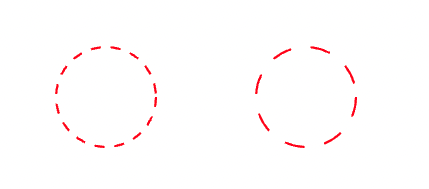
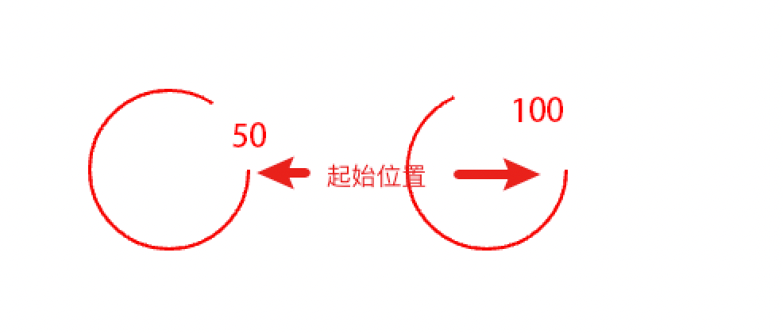
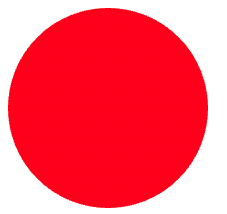

# 如何快速绘制任意角度的扇形？

注意审题，第一要快，不要太麻烦，首先可以抛弃canvas，能不用js尽量不用，第二要支持任意角度。
## 两种方案和他们的缺点
以下两种方案满足要求

方案A：很久之前写过一篇[《简单的css3 Loading动画》](https://www.cnblogs.com/wangmeijian/p/4449150.html)，原理是利用两个半圆旋转的方式，可以生成任意角度的扇形；

方案B：近期在[GitHub](https://github.com/haizlin/fe-interview/issues/527#issuecomment-507108812)看到一个利用路径裁剪的方式来生成扇形，[Demo地址](https://codepen.io/liuxiaole-the-sasster/pen/Zdrmxg)。

这两种方式用来画静态的扇形都没有什么问题，但画动态的扇形，则不那么方便。

方案A，需要根据扇形角度判断两个半圆分别需要旋转多少度；方案B更复杂一些，随着扇形角度变化，路径裁剪的参数个数也在变化，需要写一套逻辑来判断。

有没有一种方案C，可以直接传一个角度参数过去就行的？

## 方案C

先看[Demo](https://codepen.io/wangmeijian/pen/yLpBgaw?editors=1010)

核心代码如下，angle是一个参数，表示扇形角度

```svg
<svg width="200" height="200" xmlns="http://www.w3.org/2000/svg" > 
  <circle
    r="50"
    cx="100"
    cy="100"
    fill="transparent"
    stroke="red"
    stroke-width="100"
    stroke-dasharray={100 * 3.1415926}
    stroke-dashoffset={100 * 3.1415926 / 360 * (360 - angle)}
  />
</svg>
```

## 方案C原理

方案C利用svg来绘制扇形，对svg不熟悉的可以先花几分钟读一读[基础教程](https://github.com/wangmeijian/svg/issues)

这是一个圆心坐标位于（100, 100）半径为50的圆形，描边宽度为100。SVG不同于DOM，SVG的边框是同时向内外延伸的，内部的边框和它的内容重叠了，所以它渲染出来宽高不是150 * 150，而是100 * 100。将代码中的fill改为orange，stroke改为半透明的红色rgba(255, 0, 0, 0.2)，看看效果图就明白了。



重点在于stroke-dasharray和stroke-dashoffset属性。

**stroke-dasharray属性定义svg描边为虚线，值越大，虚线间隔越大**。

下图stroke-dasharray分别为10和20



**stroke-dashoffset属性定义svg描边的开头距离起始位置的偏移量，值越大，距离起始位置越远。**

下图stroke-dashoffset分别为50和100  



重点来了，回到方案C的SVG图形

当stroke-dasharray值刚好等于圆的周长时，渲染结果是这样的  



随便给stroke-dashoffset赋一个值，比如100，渲染结果如下


OK，扇形出来了，只要stroke-dashoffset的值在(0, 圆形周长)这个开区间内，渲染出来的图形就是扇形。

接下来只需要把角度参数angle和stroke-dashoffset关联起来：

一个圆总共360度，每一度偏移量值X = 周长 / 360。再用X * angle就是实际角度对应的偏移量，当angle等于90，渲染出来的扇形实际上是270度


所以，最终的stroke-dashoffset计算方法应该调整为 周长 / 360 * (360 - angle)。

## 总结

方案C中，不管扇形角度是多少，都不需要写任何逻辑判断代码，相对方案A和方案B使用起来更简便一些。


