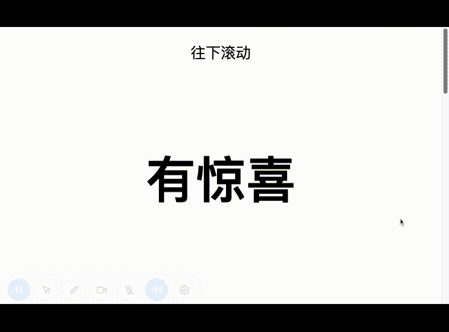

# 纯HTML+CSS 拉窗帘效果

拉窗帘效果



第一次看到这种效果的时候，感觉很惊艳，以为是js实现的，实际上纯HTML+CSS就能实现。

## 表现

上下两个白色区域都是正常的页面滚动行为，中间有颜色区域比较特殊，“拉窗帘效果”的文字滚动到一定位置后停止了，直到蓝色窗帘完全拉起之后才继续滚动，并且，在窗帘底部穿过文字时，文字呈现两种颜色。

## 实现

简单起见，这里只实现中间部分，只需要两个元素。

```html
<!-- 放窗帘的容器 -->
<div class="curtain">
  <!-- 放文字的容器 -->
  <div class="invert">拉窗帘效果</div>
</div>
```
设置一些变量
```css
:root {
  --minh: 98vh;
  --color1: wheat;
  --color2: midnightblue;
}
```
设置窗帘容器的背景，并使用::after伪元素作为小麦色块添加到窗帘容器底部

```css
.curtain {
  /* 创建分割背景色块 */
  background-image: linear-gradient(to bottom, var(--color2) 50%, var(--color1) 50%);
}

.curtain::after {
  content: "";
  display: block;
  min-height: var(--minh);
}
```

## 实现滚动暂停效果

为文字容器.invert设置position: sticky定位，使文字容器相对于他最近的滚动元素（也就是body）按left、top、right、bottom偏移

```css
.invert {
  position: sticky;
  top: 0px;

  /* 将元素内容的颜色与.curtain的背景混合 */
  mix-blend-mode: difference;

  /* 居中 */
  display: flex;
  align-items: center;
  justify-content: center;

  min-height: var(--minh);
  color: var(--color1);
  font-size: 100px;
  font-weight: bold;
}
```

## 演示

在线演示[Demo](https://codepen.io/wangmeijian/pen/rNpOewM)，包括上下白色块的完整[Demo](https://codepen.io/wangmeijian/pen/WNdvqjp)

[GitHub](https://github.com/wangmeijian/blog/issues/7)

原文链接：https://css-tricks.com/css-raise-the-curtains-effect/


